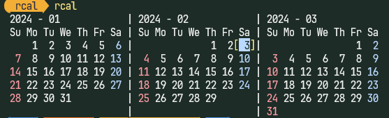

# rcal

A calendar that runs on the command line.



The order of month and year is arbitrary.
```
rcal 3 2024
rcal 2024 3
rcal 3
```

## Holiday calendar

Place `rcal.ics` beside `rcal.exe` to color its holiday dates automatically.
To use a different file, pass `-H` or `--holidays` with its path:

```
rcal 2026 1 --holidays C:\calendars\holidays.ics
```

An explicitly specified file takes precedence over `rcal.ics`. A missing default
file leaves the usual weekday colors in place; a missing or invalid explicitly
specified file produces an error. Holiday dates use the Sunday color by default.
Edit `HOLIDAY_COLOR` in `src/month_calendar.rs` to choose another color. `-z` /
`--nocolor` disables holiday colors too.

The reader supports all-day `VEVENT` dates, exclusive `DTEND`, `RDATE`, `EXDATE`,
and yearly `RRULE` with `UNTIL`, `BYMONTH`, `BYMONTHDAY`, and `BYDAY` (including
ordinal weekdays). Unsupported recurrence rules produce an error.


## HELP

```
> rcal --help
Usage: rcal.exe [OPTIONS] [MONTH] [YEAR]

Options:
  -n, --num <MONTH_NUM>       Number of months to display [default: 3]
  -c, --column <MONTH_COLUMN> Number of calendar columns [default: 3]
  -z, --nocolor              No colorize
  -H, --holidays <FILE>      Holiday calendar in iCalendar (.ics) format
  -h, --help                 Print help
  -V, --version              Print version
```
